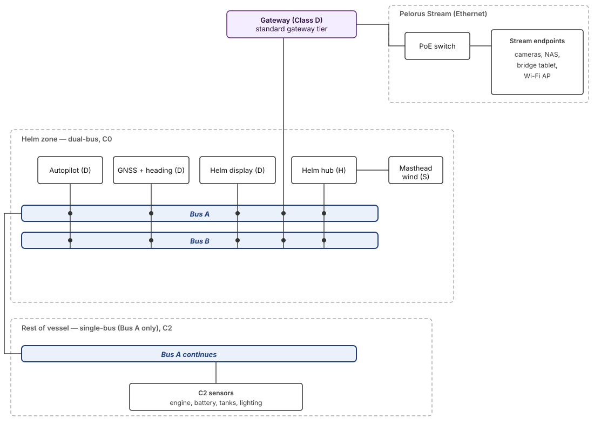

# Pelorus — architecture record

**Last Updated:** May 4, 2026  
**Status:** Living (non-normative)

## 1. Project

### Mission

Open marine data network; CAN FD core; Rust-first reference code; reliability offshore.

<h3 id="lmde">Legacy Marine Data Ecosystem (LMDE)</h3>

[**LMDE**](#lmde) is this project’s umbrella term for the certification-gated, mostly **proprietary** marine connectivity landscape—CAN fieldbuses, OEM Ethernet fabrics, and connector families that dominate recreational installs. Compared to open, sailor-owned buses, it optimizes for **vendor control** and **program revenue**. Typical drawbacks:

- **Specifications and certification** are **very expensive**—or **unobtainable outright**; where shared at all, access is often gated by **mandatory NDAs** and pay-to-play programs.
- **Interoperability** commonly means **bridges and gateway SKUs**, not one open wire format from sensor to laptop.
- **Similar-looking cable plants** can carry **incompatible framing**—looks like “marine network,” behaves like silos.
- **Helm-side debuggability** is weak: the interesting signal-level truth is frequently **contractually or practically closed**.

**Pelorus** does **not** assert bit-level compatibility with any incumbent stack.

The bulleted names below are **examples** of real-world commercial buses and networks that fall under the [**LMDE**](#lmde) umbrella—**non-exhaustive**, **nominative**, and **not** normative targets for Pelorus conformance.

- **NMEA 2000®** — Multidrop CAN instrument network; certification-gated ecosystem for certified recreational marine electronics.
- **SeaTalk NG** — Raymarine NMEA-2000-class cabling and device network for integrated displays and sensors.
- **SimNet** — Simrad / Lowrance / B&G (Navico) CAN network for MFDs, sonar, and radar interfaces.
- **SmartCraft** — Mercury / MerCruiser engine and vessel digital diagnostics and data bus.
- **Volvo Penta EVC** — Volvo propulsion and vessel control digital network.
- **Yamaha Command Link** — Yamaha outboard digital instrumentation and control bus.
- **RayNet** — Raymarine high-speed Ethernet fabric (e.g. radar / plotter backhaul).
- **Navico Ethernet** — Navico-family marine Ethernet for displays, imaging, and accessories.
- **Garmin Marine Network** — Garmin plotter, sonar, and sensor integration fabric.
- **Furuno NavNet** — Furuno integrated navigation, radar, and sensor network.
- **NMEA OneNet®** — NMEA IPv6 / Ethernet application-layer family for high-bandwidth marine IP (parallel path to 2000-class CAN for many vendors).

### Presence

- [Pelorus project site](https://sevenseas.io/pelorus) — Landing page for the Pelorus open marine data network.
- [Specifications repository](https://github.com/pelorus-marine/specifications) — Source of truth for this document set; issues and changes live here.
- [Seven Seas community](https://sevenseas.io/) — Project-facing brand and wider community entry point (not limited to Pelorus).

---

## 2. Problem Pelorus targets

Weaknesses of [**Legacy Marine Data Ecosystem**](#lmde) that Pelorus addresses:

- **Specification gate**: Proprietary message catalogs; costly certification; NDAs—hard for sailors and small builders to inspect, extend, or verify independently.
- **Lab-first qualification**: Conformance is proven on the bench, not under years of salt spray, vibration, wet connectors, and RF-rich passages.
- **Always-on drain**: Without selective sleep as the norm, the suite draws continuous aggregate current even when voyage context makes much of it useless for days.
- **Classical CAN ceiling**: Install base is stuck at ~250 kbit/s Classical CAN and **8-byte** frames; Pelorus Core uses **CAN FD** with **up to 64-byte** frames. Typical navigation/engine DCIDs still don’t need “more Mbps” as much as openness, power discipline, and behavior.
- **Backbone fault domain**: A linear segment is one electrical island—opens, shorts, or bad terminators can blind **everything** on that backbone.
- **Opaque diagnostics**: Little vendor-neutral tooling to capture and decode live traffic as **your** ship’s contract.
- **Vendor islands**: Optional-field gaps and proprietary extensions → cross-brand surprises and **gateway-heavy** rigs despite compatible cabling.
- **Parallel Ethernet silos**: Vendor marine Ethernet fabrics add another incompatible layer beside CAN—more cables, boxes, and translation—not one unified media plane.
- **Cadence drag**: Cert-gated evolution is slow next to automotive or IT stack velocity—features queue behind programs and committee cycles.
- **Tooling capture**: Firmware updates and deep diagnostics often depend on OEM apps, dongles, or dealer chains—not something you fully own at anchor.

---

## 3. Subsystems

### [Core](./core/01-overview.md)

**CAN FD fieldbus** for safety-critical instrumentation and controls. Application traffic is defined by Pelorus [**DCIDs**](./core/07-dcid-registry.md) — the wire contracts naming payloads and semantics on the bus—with selective wake groups and **M12 DeviceNet** physical plant.

**Path redundancy:** Where **[criticality class](./core/08-redundancy.md)** **C0** or **C1** requires it, Pelorus Core uses **dual** independent CAN FD buses (**Bus A** / **Bus B**) with active-active replication and receiver duplicate discard (**[08 §6](./core/08-redundancy.md#6-active-active-transmission-and-duplicate-discard)**). That is **orthogonal** to **repeater segmentation** (length and fault containment). **Reliability and durability** are ordered ahead of install convenience when they conflict (**[01 §6](./core/01-overview.md#6-design-principles)**).

The rest of Pelorus stacks around **Core** as the authoritative source of wired device contracts; Stream and higher layers must not degrade Core when they fail.

[**LMDE**](#lmde) and Pelorus Core are [**not** same-segment‑interoperable](./core/01-overview.md#4-coexistence-with-the-legacy-marine-data-ecosystem).

### [Stream](./stream/01-overview.md)

Ethernet **non-safety-critical** layer for bandwidth-heavy traffic: **M12** D-coded 100 Mbit/s, IPv6, discovery—a **transport** substrate, **not** an actuator or safety plane. Example use cases include:

- Bridge monitoring
- Engine diagnostics
- Voyage data recording
- Radar integration
- ECDIS connectivity
- AIS data sharing
- Remote vessel monitoring
- Smart sensor networks
- Autonomous navigation support
- Cybersecure marine networking
- Cloud data synchronization
- Fleet management analytics
- Real-time weather data integration
- Port communication systems
- Onboard IoT device integration
- CCTV and video surveillance streaming
- Docking and situational awareness cameras
- Passenger infotainment systems
- Distributed audio/music systems
- Crew communication and video conferencing

**Core stays authoritative** for safety-critical semantics.

**Core → Stream:** Telemetry and identity/metadata aligned with DCIDs are bridged onto Stream through the **standard gateway**.

**Stream → Core:** Reverse injection onto the Core fieldbus—anything originating on the Ethernet side toward CAN—is permitted **only** through a **capable bidirectional gateway**. Arbitrary Stream publishers **must not** originate traffic as Core talkers.

### [State](./state/01-overview.md)

**Pelorus State** (when specified) coordinates priorities among publishers. Stream transports payloads; it does **not** replace Core as nautical truth.

Logical **event → snapshot → situation → policy/intent** pipeline **above** Core and Stream, with **no** fieldbus or Ethernet I/O of its own.

For a worked example of how Core and Stream sit together on a real vessel, see [§4 Sample combined network](#4-sample-combined-network--40-ft-sailing-yacht).

---

## 4. Sample combined network — 40 ft sailing yacht

This section is **non-normative**. It illustrates how the pieces in §3 fit together on a representative cruising sailing yacht (~40 ft / ~12 m). Numbers — counts of sensors, exact bus lengths, gateway placement — are illustrative; a real install is captured in a **critical zone map** per [`core/08 §12`](./core/08-redundancy.md#12-critical-zone-map-and-conformance).

### 4.1 Vessel context and choices

- One **dual-bus C0 zone** at the helm: autopilot, GNSS + heading, helm display, masthead wind. This is the only zone where loss of Core would imminently affect vessel control, so it gets **path redundancy** ([`core/08 §2.1`](./core/08-redundancy.md#21-c0--safety-critical-path)).
- **Single-bus C2** everywhere else: engine telemetry, battery monitor, tank levels, cabin lighting state. Loss of these does not affect safe navigation; they share a single backbone (Bus A) that extends out from the helm zone.
- One **standard gateway** ([`core/09 §6`](./core/09-network.md#6-core--stream-coupling)) bridges Core onto Pelorus Stream and acts as binding authority. It is **Class D**, so it remains reachable on whichever bus survives in the helm zone.
- **Pelorus Stream** carries non-safety media: cameras, NAS, a bridge tablet that subscribes to mirrored Core telemetry, and a Wi-Fi AP. Stream **does not** originate Core traffic — there is no capable bidirectional gateway here ([`core/09 §6`](./core/09-network.md#6-core--stream-coupling); [`stream/01 §3.1`](./stream/01-overview.md#31-the-stream--core-boundary)).

### 4.2 Topology diagram

> Diagram source: [`diagrams/topology.drawio.svg`](./diagrams/topology.drawio.svg). The file follows the `.drawio.svg` convention — a regular SVG image that is also editable in [draw.io](https://app.diagrams.net) (File → Open from device, or drag-drop). Plain text, lives alongside the spec, edits diff cleanly in git. The first time you save from draw.io, it will embed its own `<mxGraphModel>` source in the SVG's `content` attribute for full round-trip fidelity.
>
> **Legend.** `D` = Class D (dual transceiver), `S` = Class S (single), `H` = Class H (hub). Bus A is the single backbone outside the helm zone; Bus B exists only inside the helm dual-bus domain. Filled dots are bus taps.

### 4.3 Walk-through — Core side

| Where | Class | Criticality | What it does |
|---|---|---|---|
| Helm — autopilot ECU | **D** | **C0** | Closes the rudder loop on heading from the GNSS+heading unit; needs both buses to keep operating through a single-bus failure. |
| Helm — GNSS + heading | **D** | **C0** | Primary nav source; replicates active-active on Bus A and Bus B with **PRH** in any future Pelorus-native broadcast DCID, payload-and-ID dedup for J1939 heritage messages ([`core/08 §6`](./core/08-redundancy.md#6-active-active-transmission-and-duplicate-discard)). |
| Helm — display | **D** | **C0** | Primary chartplotter / autopilot console. |
| Helm — Class H hub | **H** | C0 (within helm) | Bridges the masthead **Class S** wind sensor into the dual-bus domain; applies bidirectional duplicate discard before forwarding upstream ([`core/09 §3.3`](./core/09-network.md#33-hub-bidirectional-duplicate-discard)). On a hub backbone bus-off it surfaces `Bus state = Degraded-Single` in **0x0FF82** ([`core/09 §3.4`](./core/09-network.md#34-hub-bus-off-and-degraded-backbone)). |
| Masthead — wind sensor | **S** | informs C0 helm | Single cable down the mast; dual-bus visibility comes from the hub, not from the sensor itself. |
| Engine bay — engine telemetry, battery monitor | **S** | **C2** | Informational; engine alarms / shutdown remain on the dedicated engine harness, not on Pelorus Core. |
| Saloon — tank sensors, lighting state | **S** | **C2** | Comfort and logging. |
| Helm — gateway | **D** | spans C0 + Stream | Standard gateway tier per [`core/09 §6`](./core/09-network.md#6-core--stream-coupling); attaches to **both** Bus A and Bus B to remain reachable in degraded single-bus operation. |

**Selected DCIDs in play.** [`core/07`](./core/07-dcid-registry.md):

- **0x0FF82** — Bus Health, transmitted by every Class D / Class H node on each bus at 2 s ± 500 ms.
- **0x0FF83** — Time Sync (optional). Recommended here since the helm zone is C0; the gateway acts as Time Master so `D_clk ≤ 10 ms` and the receiver `DISCARD_WINDOW = 50 ms` is sufficient ([`core/08 §6.3.3`](./core/08-redundancy.md#633-discard_window-lower-bound)).
- Compatibility DCIDs (J1939 heritage) for engine, heading, GNSS, etc. ([`core/07 §2`](./core/07-dcid-registry.md)) — replicated with identical SA/payload on Bus A and Bus B inside the helm zone, deduplicated by payload-and-ID ([`core/08 §6.3.2`](./core/08-redundancy.md#632-compatibility-and-other-application-dcids-no-prh)).

### 4.4 Walk-through — Stream side

- **PoE M12 D-coded switch** powers the cameras and Wi-Fi AP. The bridge tablet and the NAS sit on the same switch.
- **Bridge tablet** subscribes to mirrored Core telemetry that the gateway publishes on Stream (Core → Stream, standard gateway tier). It is **read-only** — it cannot originate frames on Core ([`stream/01 §3.1`](./stream/01-overview.md#31-the-stream--core-boundary)).
- **Cameras** stream live video to the NAS / bridge tablet over best-effort UDP (or QUIC for retained clips). They do not touch Core at all.
- **Wi-Fi AP** is for cabin / crew devices; same isolation rules apply.

### 4.5 What happens during a single-bus failure (helm zone)

1. A connector on **Bus B** opens between the autopilot and the gateway.
2. Class D nodes on the helm continue transmitting active-active; receivers on the helm zone now see only **Bus A** copies.
3. The **DDT** on each receiver was already accepting one copy per logical frame, so application delivery is uninterrupted — no message gap larger than `DISCARD_WINDOW + max(producer_period)` ([`core/08 §10.1`](./core/08-redundancy.md#101-failover-convergence-c0--c1)).
4. Bus Health on Bus A reports `Bus state = Degraded-Single`; the helm display lights an operator-visible annunciator within 5 s ([`core/08 §10`](./core/08-redundancy.md#10-degraded-mode-behaviour)).
5. The single-bus C2 domain (engine, tanks, lighting) is unaffected — it was already on Bus A only.
6. Stream is unaffected — its substrate is independent.
7. When the connector is repaired, Bus B returns. Receivers accept frames on the returning bus and apply normal duplicate discard; no re-sync handshake ([`core/08 §10.2`](./core/08-redundancy.md#102-bus-return-after-failure)).

### 4.6 What this example deliberately does **not** show

- **Class D mandate everywhere** — the C2 zone deliberately stays single-bus to keep cost and cabling proportionate to the safety case.
- **Capable bidirectional gateway** — none here; the bridge tablet cannot drive helm or autopilot. Adding one is a future option for vessels that need Stream-originated Core writes and is gated by [`core/09 §6`](./core/09-network.md#6-core--stream-coupling).
- **Higher data rates** — v1.0 is a single named profile (250 / 500 kbit/s, 30 m / 6 m / 50 nodes per bus) per [`core/08 §4.4`](./core/08-redundancy.md#44-bit-rate-and-length-scope). Higher rates will arrive as additional named profiles, not via a generic length-vs-rate scaling.

---

## 5. Trademarks and third-party names

Pelorus is an independent open specification. **This is not legal advice**; consult counsel before shipping product packaging, marketing, or certifications that cite other organizations’ brands.

The commercial networks named as examples under [**Legacy Marine Data Ecosystem (LMDE)**](#lmde) — **NMEA 2000®**, **SeaTalk NG**, **SimNet**, **SmartCraft**, **Volvo Penta EVC**, **Yamaha Command Link**, **RayNet**, **Navico Ethernet**, **Garmin Marine Network**, **Furuno NavNet**, **NMEA OneNet®**, and the vendor / house marks referenced in those lines (including **Raymarine**, **Navico**, **Simrad**, **Lowrance**, **B&G**, **Garmin**, **Furuno**, **Volvo Penta**, **Yamaha**, **Mercury**, **MerCruiser**) — are **third-party** names cited **nominatively** to identify real-world buses and fabrics; **rights belong to their respective owners**, not Pelorus.

**Practical editorial rules for this repository:**

1. Default to [**LMDE**](#lmde) and neutral wording for the incumbent ecosystem; name specific products only when it helps the reader.
2. **Compare:** name the program **once**, then use neutral phrases for the rest of the section (**nominative fair use**).
3. **No** implied endorsement or wire-level compatibility unless a normative doc proves it. Use **“OneNet-style”** / **“N2K-class”** only for general categories of behavior.
4. **NMEA 2000®** and **NMEA OneNet®** are **NMEA** marks—spell correctly; **®** on first prominent use where counsel advises. Other names above are **third-party marks**—treat likewise.
5. **Pelorus** is **not** an **NMEA** product name and is **not** “NMEA-compatible” unless a conformance document establishes that with tests.

